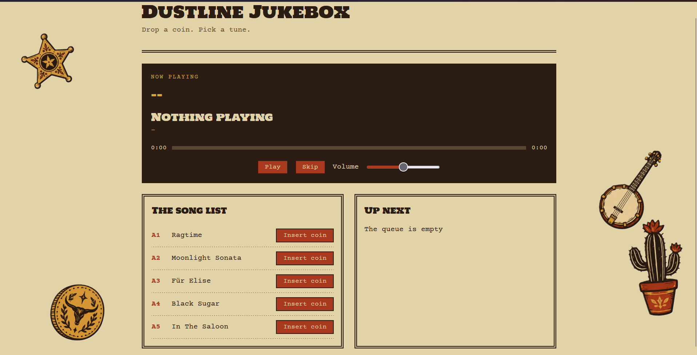
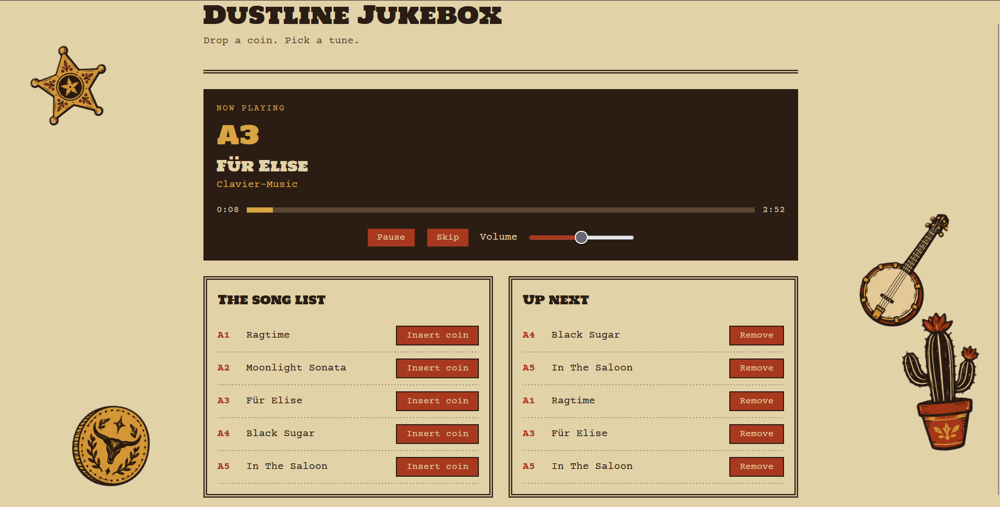

# Dustline Jukebox
A simple jukebox that runs in the browser. Pick songs from the list, drop a coin to add them to the queue, and they play one after another.

**Try it: [Live Website](https://dustlinejukebox.netlify.app/)**

## What it is
Dustline Jukebox is a jukebox that runs in the browser. Browse the song list, drop a coin to add a track to the queue, and everything plays in order, with play, pause, skip and volume controls and a now-playing panel that shows the current song.
It's styled like an old Western poster instead of a typical music player: a paper-coloured background, dark brown ink-style text, rust red buttons, gold highlights and double-line borders.

## Features
- A song list with five tracks, each with a selection code (A1, A2...)
- A visible queue: press **Insert coin** to add a song and **Remove** to take it back out
- Play, pause, skip and a volume slider
- A now-playing panel with the title and artist

## Built with
- HTML5, CSS3 and JavaScript
- The HTML `<audio>` element for playback
- Google Fonts: Holtwood One SC and Courier Prime

## How to run it locally
No install or build step is needed.
1. Clone the repo.
2. Open `index.html` in a browser.
The fonts load from Google Fonts, so they need an internet connection. Without one, the page falls back to the browser's default fonts and still works.

## Adding your own songs
1. Put the mp3 file in the `audio` folder, with a lowercase filename and no spaces.
2. Open `script.js` and add a new object to the `tracks` array with a code, title, artist and file path (for example `assets/my-song.mp3`).

Only add music you have the right to share, if you are going to make it public.

## Screenshots
### Home screen

### A song playing with a queue

## Music credits
All tracks are from Pixabay Music and used under the Pixabay Content License.

| Code | Title | Artist |
|------|-------|--------|
| A1 | Ragtime | Back_Drop |
| A2 | Moonlight Sonata | GregorQuendel |
| A3 | Für Elise | Clavier-Music |
| A4 | Black Sugar | MoonpetalMedia |
| A5 | In The Saloon | Piano_Music |

## Sticker art
The four stickers on the sides of the page were generated with ChatGPT from a prompt I wrote, then cropped and cleaned up by me. They are only decoration.

## Known limitations
- The queue is stored in each visitor's own browser, so two people on different devices have separate queues.
- Refreshing the page clears the queue.

## Built with AI assistance
I used Claude (an AI assistant) as a tutor while building this, since I started with HTML and CSS and no JavaScript.
- It explained concepts before I wrote any code (arrays, objects, functions, the DOM, events and the audio element).
- It gave me small step-by-step guides, and I typed every line of the code myself.
- It reviewed the code I pasted and explained my bugs, such as a missing function call and a variable I never created.
- It suggested the visual direction and fonts, which I approved.
- A few small pieces were given to me directly: a re-indented block of HTML, showQueue function code and a CSS fix for the sticker positions.

I chose the music, made the stickers, tested everything and deployed the site.
